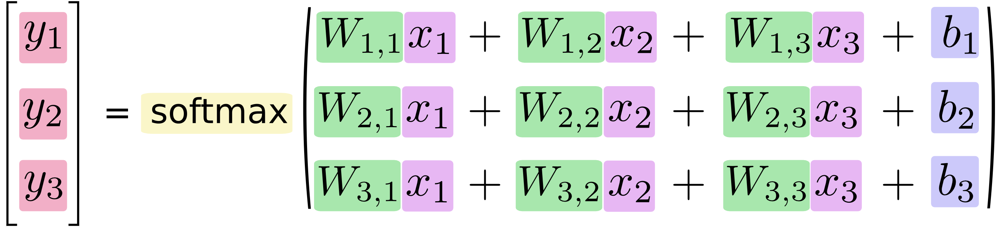

# 机器学习初学者MNIST <a class="md-anchor" id="AUTOGENERATED-mnist-for-ml-beginners"></a>

*这篇教程主要面向机器学习及TensorFlow的新手。如果你已经了解MNIST和Softmax多项逻辑回归，
建议跳到这篇文章[快速教程](../../../tutorials/mnist/pros/index.md)。*

对于学习编程的新手，传统做法是编写打印“Hello World”的程序。就像编程打印“Hello World”，
机器学习入门就是MNIST数据处理。

MNIST是一个简单的计算机视觉数据集，它包含如下一样的手写数字图像文件：

<div style="width:40%; margin:auto; margin-bottom:10px; margin-top:20px;">

</div>

同时，对每一张图像，它还具有对应的数字标签。例如，以上图像的数字标签为5，0，4和1。

在这篇教程中，我们将通过训练模型来找到图像及其对应的数字标签。当然我们的初期目标不是训练
一个具有先进性能的复杂模型（后面的教程会涉及），而是学习开始使用TensorFlow来建立一些简单
模型，比如Softmax回归。

这篇教程的实际代码非常短小，最核心的代码只有3行。但是理解代码背后的思想非常重要，包括TensorFLow
如何工作以及机器学习的核心概念。正因如此，我们将非常仔细地解释每行代码。

## MNIST数据集 <a class="md-anchor" id="AUTOGENERATED-the-mnist-data"></a>

MNIST数据集托管在[Yann LeCun的网站](http://yann.lecun.com/exdb/mnist/)。为了下载更加方便，
我们编写了一段python代码来自动下载和安装这些数据集。
你可以下载[脚本](https://tensorflow.googlesource.com/tensorflow/+/master/tensorflow/g3doc/tutorials/mnist/input_data.py)
并在自己的代码中如下引用或者直接拷贝到代码中。

```python
import input_data
mnist = input_data.read_data_sets("MNIST_data/", one_hot=True)
```

下载的数据集分为两部分，包括6万条训练数据(`mnist.train`)和1万条测试数据(`mnist.test`)。
这种分拆非常重要：机器学习必要的分离一些独立于学习的数据，以便能够验证我们所学习的模型正确性。

正如前面提到的，每一条MNIST数据都包括两部分：一张手写的数字图像和一个对应的数字标签。
我们称这些图像为“xs”，标签为“ys”。训练集和测试集都包含xs和ys，例如训练集图像为“mnist.train.images”，
训练集标签为“mnist.train.labels”。

每张图像是28像素x28像素，我们可以将此转换为一个大数组：

<div style="width:50%; margin:auto; margin-bottom:10px; margin-top:20px;">

</div>

我们能将这个二维28x28数组扁平化为784个数字。只要我们能跟图像数据一致，无所谓如何扁平化这些数组。
从这个角度看，MNIST图像集只是一堆784维的向量空间，[非常丰富的结构](http://colah.github.io/posts/2014-10-Visualizing-MNIST/)
（警告：计算密集型可视化）。

扁平化数据会丢掉图像的二维结构信息。这是否很糟呢？好吧，最好的计算机视觉方法确实会利用这些结构信息，
我们在之后的教程中也会用到。但是我们在这里使用的简单Softmax回归模型将不会使用。

结果就是`mnist.train.images`是一个tensor（n维数组），形式为`[60000, 784]`。第一个维度代表图像索引，
第二个维度代表每张图的像素集。Tensor中的每一个位置代表每张图像每个像素位于0至1区间的像素强度。

<div style="width:40%; margin:auto; margin-bottom:10px; margin-top:20px;">

</div>

MNIST中对应的数字标签介于0到9，表示图像所代表的数字。为了教程目标，我们将这些标签作为一个“one-hot”向量。
在这种稀疏向量中，大部分维度数字为0，而且1只出现在某一维上。这种情况下，第\\(n\\)个数字将表示为1出现在
\\(n\\)维上的向量。比如，3将表示为\\([0,0,0,1,0,0,0,0,0,0]\\)。因此，`mnist.train.labels`是
`[60000, 10]`形式的浮点数组。

<div style="width:40%; margin:auto; margin-bottom:10px; margin-top:20px;">

</div>

现在准备实际训练我们的模型！

## Softmax回归 <a class="md-anchor" id="AUTOGENERATED-softmax-regressions"></a>

我们知道MNIST中每张图片是一个数字，无论是0还是9。我们想要能够找到一张图片并且给出它属于每个数字的可能性。
例如，我们可能找到一张9的图像，计算出80%的可能性是9，5%的可能性是8（因为8和9上面都有一个小圈），还有很小
的一部分可能性是其他数字。

这是一个经典的案例，Softmax回归是一个自然、简单的模型。如果你想赋予一个对象属于多个不同事实的可能性，那么
Softmax是一个不错的选择。即便当我们要训练一些复杂模型，最后一步也可能为Softmax模型层。

一个Softmax回归包含两步：首先，我们在某些分类中将输入数据的凭据进行累加，然后，我们将这些凭据转化为可能性。

为了计算出所给图像在某个特定分类中的凭据，我们对像素强度进行加权和。如果像素具有不属于某一个分类的高强度凭据，
那么权重为负值，相反则为正值。

下图显示了一种学习模型为每一个分类产生的权重。红色部分代表负值权重，而蓝色部分代表正值权重。

<div style="width:40%; margin:auto; margin-bottom:10px; margin-top:20px;">

</div>

我们还将加入一些额外的凭据偏差。基本上，我们能够说某个事实几乎独立于输入，结果就是给出输入\\(x\\)，得到
分类\\(i\\)的凭据。

$$\text{evidence}_i = \sum_j W_{i,~ j} x_j + b_i$$

其中\\(W\_i\\)是权重，\\(b\_i\\)是分类\\(i\\)的偏差，\\(j\\)下标是输入图像\\(x\\)像素所在位置，它将用于累加
遍历图像的所有像素权重值。之后我们将使用“softmax”函数转换凭据值到我们的预测概率\\(y\\)。

$$y = \text{softmax}(\text{evidence})$$

这里的softmax是一个激活或者连接函数，可以将我们的线型函数变形为我们想要的形式——在这个案例中，就是分布于10个
分类的概率分布。你可以认为这是将我们每个分类输入凭据转换为概率。定义如下：

$$\text{softmax}(x) = \text{normalize}(\exp(x))$$

如果展开这个等式，将得到：

$$\text{softmax}(x)_i = \frac{\exp(x_i)}{\sum_j \exp(x_j)}$$

但是首先理解softmax的最佳办法是：幂指化它的输入，然后再归一化它们。求幂意味着通过对权重进行某种相乘以获取更大
的凭据。相反，较小的凭据意味着获取它的早期权重的一部分，甚至没有权重或负权重。Softmax然后将这些权重值进行归一，
以保证加起来是1，构造成一个合理的概率分布。（要获取关于softmax函数更多认识，点击[链接](http://neuralnetworksanddeeplearning.com/chap3.html#softmax)，参考迈克尔.尼尔森的书，彻底的可视化交互。）


你You can picture our softmax regression as looking something like the following,
although with a lot more \\(x\\)s. For each output, we compute a weighted sum of
the \\(x\\)s, add a bias, and then apply softmax.

<div style="width:55%; margin:auto; margin-bottom:10px; margin-top:20px;">

</div>

If we write that out as equations, we get:

<div style="width:52%; margin-left:25%; margin-bottom:10px; margin-top:20px;">

</div>

We can "vectorize" this procedure, turning it into a matrix multiplication
and vector addition. This is helpful for computational efficiency. (It's also
a useful way to think.)

<div style="width:50%; margin:auto; margin-bottom:10px; margin-top:20px;">

</div>

More compactly, we can just write:

$$y = \text{softmax}(Wx + b)$$


## Implementing the Regression <a class="md-anchor" id="AUTOGENERATED-implementing-the-regression"></a>


To do efficient numerical computing in Python, we typically use libraries like
NumPy that do expensive operations such as matrix multiplication outside Python,
using highly efficient code implemented in another language.
Unfortunately, there can still be a lot of overhead from switching back to
Python every operation. This overhead is especially bad if you want to run
computations on GPUs or in a distributed manner, where there can be a high cost
to transferring data.

TensorFlow also does its heavy lifting outside python,
but it takes things a step further to avoid this overhead.
Instead of running a single expensive operation independently
from Python, TensorFlow lets us describe a graph of interacting operations that
run entirely outside Python. (Approaches like this can be seen in a few
machine learning libraries.)

To use TensorFlow, we need to import it.

```python
import tensorflow as tf
```

We describe these interacting operations by manipulating symbolic variables.
Let's create one:

```python
x = tf.placeholder("float", [None, 784])
```

`x` isn't a specific value. It's a `placeholder`, a value that we'll input when
we ask TensorFlow to run a computation. We want to be able to input any number
of MNIST images, each flattened into a 784-dimensional vector. We represent
this as a 2d tensor of floating point numbers, with a shape `[None, 784]`.
(Here `None` means that a dimension can be of any length.)

We also need the weights and biases for our model. We could imagine treating
these like additional inputs, but TensorFlow has an even better way to handle
it: `Variable`.
A `Variable` is a modifiable tensor that lives in TensorFlow's graph of
interacting
operations. It can be used and even modified by the computation. For machine
learning applications, one generally has the model parameters be `Variable`s.

```python
W = tf.Variable(tf.zeros([784,10]))
b = tf.Variable(tf.zeros([10]))
```

We create these `Variable`s by giving `tf.Variable` the initial value of the
`Variable`: in this case, we initialize both `W` and `b` as tensors full of
zeros. Since we are going to learn `W` and `b`, it doesn't matter very much
what they initially are.

Notice that `W` has a shape of [784, 10] because we want to multiply the
784-dimensional image vectors by it to produce 10-dimensional vectors of
evidence for the difference classes. `b` has a shape of [10] so we can add it
to the output.

We can now implement our model. It only takes one line!

```python
y = tf.nn.softmax(tf.matmul(x,W) + b)
```

First, we multiply `x` by `W` with the expression `tf.matmul(x,W)`. This is
flipped from when we multiplied them in our equation, where we had \\(Wx\\), as a
small trick
to deal with `x` being a 2D tensor with multiple inputs. We then add `b`, and
finally apply `tf.nn.softmax`.

That's it. It only took us one line to define our model, after a couple short
lines of setup. That isn't because TensorFlow is designed to make a softmax
regression particularly easy: it's just a very flexible way to describe many
kinds of numerical computations, from machine learning models to physics
simulations. And once defined, our model can be run on different devices:
your computer's CPU, GPUs, and even phones!


## Training <a class="md-anchor" id="AUTOGENERATED-training"></a>

In order to train our model, we need to define what it means for the  model to
be good. Well, actually, in machine learning we typically define what it means
for a model to be bad, called the cost or loss, and then try to minimize how bad
it is. But the two are equivalent.

One very common, very nice cost function is "cross-entropy." Surprisingly,
cross-entropy arises from thinking about information compressing codes in
information theory but it winds up being an important idea in lots of areas,
from gambling to machine learning. It's defined:

$$H_{y'}(y) = -\sum_i y'_i \log(y_i)$$

Where \\(y\\) is our predicted probability distribution, and \\(y'\\) is the true
distribution (the one-hot vector we'll input).  In some rough sense, the
cross-entropy is measuring how inefficient our predictions are for describing
the truth. Going into more detail about cross-entropy is beyond the scope of
this tutorial, but it's well worth
[understanding](http://colah.github.io/posts/2015-09-Visual-Information/).

To implement cross-entropy we need to first add a new placeholder to input
the correct answers:

```python
y_ = tf.placeholder("float", [None,10])
```

Then we can implement the cross-entropy, \\(-\sum y'\log(y)\\):

```python
cross_entropy = -tf.reduce_sum(y_*tf.log(y))
```

First, `tf.log` computes the logarithm of each element of `y`. Next, we multiply
each element of `y_` with the corresponding element of `tf.log(y)`. Finally,
`tf.reduce_sum` adds all the elements of the tensor. (Note that this isn't
just the cross-entropy of the truth with a single prediction, but the sum of the
cross-entropies for all 100 images we looked at. How well we are doing on 100
data points is a much better description of how good our model is than a single
data point.)

Now that we know what we want our model to do, it's very easy to have TensorFlow
train it to do so.
Because TensorFlow knows the entire graph of your computations, it
can automatically use the [backpropagation
algorithm](http://colah.github.io/posts/2015-08-Backprop/)
to efficiently determine how your variables affect the cost you ask it minimize.
Then it can apply your choice of optimization algorithm to modify the variables
and reduce the cost.

```python
train_step = tf.train.GradientDescentOptimizer(0.01).minimize(cross_entropy)
```

In this case, we ask TensorFlow to minimize `cross_entropy` using the gradient
descent algorithm with a learning rate of 0.01. Gradient descent is a simple
procedure, where TensorFlow simply shifts each variable a little bit in the
direction that reduces the cost. But TensorFlow also provides
[many other optimization algorithms]
(../../../api_docs/python/train.md#optimizers): using one is as simple as
tweaking one line.

What TensorFlow actually does here, behind the scenes, is it adds new operations
to your graph which
implement backpropagation and gradient descent. Then it gives you back a
single operation which, when run, will do a step of gradient descent training,
slightly tweaking your variables to reduce the cost.

Now we have our model set up to train. One last thing before we launch it,
we have to add an operation to initialize the variables we created:

```python
init = tf.initialize_all_variables()
```

We can now launch the model in a `Session`, and run the operation that
initializes the variables:

```python
sess = tf.Session()
sess.run(init)
```

Let's train -- we'll run the training step 1000 times!

```python
for i in range(1000):
  batch_xs, batch_ys = mnist.train.next_batch(100)
  sess.run(train_step, feed_dict={x: batch_xs, y_: batch_ys})
```

Each step of the loop, we get a "batch" of one hundred random data points from
our training set. We run `train_step` feeding in the batches data to replace
the `placeholder`s.

Using small batches of random data is called stochastic training -- in
this case, stochastic gradient descent. Ideally, we'd like to use all our data
for every step of training because that would give us a better sense of what
we should be doing, but that's expensive. So, instead, we use a different subset
every time. Doing this is cheap and has much of the same benefit.


## Evaluating Our Model <a class="md-anchor" id="AUTOGENERATED-evaluating-our-model"></a>

How well does our model do?

Well, first let's figure out where we predicted the correct label. `tf.argmax`
is an extremely useful function which gives you the index of the highest entry
in a tensor along some axis. For example, `tf.argmax(y,1)` is the label our
model thinks is most likely for each input, while `tf.argmax(y_,1)` is the
correct label. We can use `tf.equal` to check if our prediction matches the
truth.

```python
correct_prediction = tf.equal(tf.argmax(y,1), tf.argmax(y_,1))
```

That gives us a list of booleans. To determine what fraction are correct, we
cast to floating point numbers and then take the mean. For example,
`[True, False, True, True]` would become `[1,0,1,1]` which would become `0.75`.

```python
accuracy = tf.reduce_mean(tf.cast(correct_prediction, "float"))
```

Finally, we ask for our accuracy on our test data.

```python
print sess.run(accuracy, feed_dict={x: mnist.test.images, y_: mnist.test.labels})
```

This should be about 91%.

Is that good? Well, not really. In fact, it's pretty bad. This is because we're
using a very simple model. With some small changes, we can get to
97%. The best models can get to over 99.7% accuracy! (For more information, have
a look at this
[list of results](http://rodrigob.github.io/are_we_there_yet/build/classification_datasets_results.html).)

What matters is that we learned from this model. Still, if you're feeling a bit
down about these results, check out [the next tutorial](../../../tutorials/index.md) where we
do a lot better, and learn how to build more sophisticated models using
TensorFlow!
