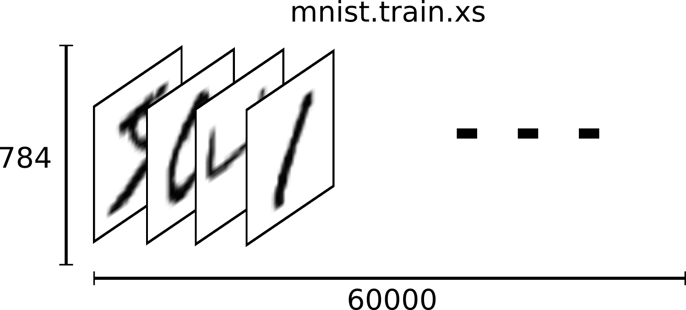
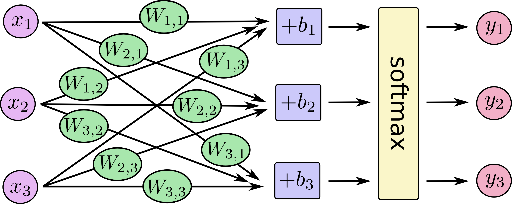

# 机器学习初学者MNIST <a class="md-anchor" id="AUTOGENERATED-mnist-for-ml-beginners"></a>

*这篇教程主要面向机器学习及TensorFlow的新手。如果你已经了解MNIST和Softmax多项逻辑回归，
建议跳到这篇文章[快速教程](../../../tutorials/mnist/pros/index.md)。*

对于学习编程的新手，传统做法是编写打印“Hello World”的程序。就像编程打印“Hello World”，
机器学习入门就是MNIST数据处理。

MNIST是一个简单的计算机视觉数据集，它包含如下一样的手写数字图像文件：

<div style="width:40%; margin:auto; margin-bottom:10px; margin-top:20px;">

</div>

同时，对每一张图像，它还具有对应的数字标签。例如，以上图像的数字标签为5，0，4和1。

在这篇教程中，我们将通过训练模型来找到图像及其对应的数字标签。当然我们的初期目标不是训练
一个具有先进性能的复杂模型（后面的教程会涉及），而是学习开始使用TensorFlow来建立一些简单
模型，比如Softmax回归。

这篇教程的实际代码非常短小，最核心的代码只有3行。但是理解代码背后的思想非常重要，包括TensorFLow
如何工作以及机器学习的核心概念。正因如此，我们将非常仔细地解释每行代码。

## MNIST数据集 <a class="md-anchor" id="AUTOGENERATED-the-mnist-data"></a>

MNIST数据集托管在[Yann LeCun的网站](http://yann.lecun.com/exdb/mnist/)。为了下载更加方便，
我们编写了一段python代码来自动下载和安装这些数据集。
你可以下载[脚本](https://tensorflow.googlesource.com/tensorflow/+/master/tensorflow/g3doc/tutorials/mnist/input_data.py)
并在自己的代码中如下引用或者直接拷贝到代码中。

```python
import input_data
mnist = input_data.read_data_sets("MNIST_data/", one_hot=True)
```

下载的数据集分为两部分，包括6万条训练数据(`mnist.train`)和1万条测试数据(`mnist.test`)。
这种分拆非常重要：机器学习必要的分离一些独立于学习的数据，以便能够验证我们所学习的模型正确性。

正如前面提到的，每一条MNIST数据都包括两部分：一张手写的数字图像和一个对应的数字标签。
我们称这些图像为“xs”，标签为“ys”。训练集和测试集都包含xs和ys，例如训练集图像为“mnist.train.images”，
训练集标签为“mnist.train.labels”。

每张图像是28像素x28像素，我们可以将此转换为一个大数组：

<div style="width:50%; margin:auto; margin-bottom:10px; margin-top:20px;">

</div>

我们能将这个二维28x28数组扁平化为784个数字。只要我们能跟图像数据一致，无所谓如何扁平化这些数组。
从这个角度看，MNIST图像集只是一堆784维的向量空间，[非常丰富的结构](http://colah.github.io/posts/2014-10-Visualizing-MNIST/)
（警告：计算密集型可视化）。

扁平化数据会丢掉图像的二维结构信息。这是否很糟呢？好吧，最好的计算机视觉方法确实会利用这些结构信息，
我们在之后的教程中也会用到。但是我们在这里使用的简单Softmax回归模型将不会使用。

结果就是`mnist.train.images`是一个tensor（n维数组），形式为`[60000, 784]`。第一个维度代表图像索引，
第二个维度代表每张图的像素集。Tensor中的每一个位置代表每张图像每个像素位于0至1区间的像素强度。

<div style="width:40%; margin:auto; margin-bottom:10px; margin-top:20px;">

</div>

MNIST中对应的数字标签介于0到9，表示图像所代表的数字。为了教程目标，我们将这些标签作为一个“one-hot”向量。
在这种稀疏向量中，大部分维度数字为0，而且1只出现在某一维上。这种情况下，第\\(n\\)个数字将表示为1出现在
\\(n\\)维上的向量。比如，3将表示为\\([0,0,0,1,0,0,0,0,0,0]\\)。因此，`mnist.train.labels`是
`[60000, 10]`形式的浮点数组。

<div style="width:40%; margin:auto; margin-bottom:10px; margin-top:20px;">

</div>

现在准备实际训练我们的模型！

## Softmax回归 <a class="md-anchor" id="AUTOGENERATED-softmax-regressions"></a>

我们知道MNIST中每张图片是一个数字，无论是0还是9。我们想要能够找到一张图片并且给出它属于每个数字的可能性。
例如，我们可能找到一张9的图像，计算出80%的可能性是9，5%的可能性是8（因为8和9上面都有一个小圈），还有很小
的一部分可能性是其他数字。

这是一个经典的案例，Softmax回归是一个自然、简单的模型。如果你想赋予一个对象属于多个不同事实的可能性，那么
Softmax是一个不错的选择。即便当我们要训练一些复杂模型，最后一步也可能为Softmax模型层。

一个Softmax回归包含两步：首先，我们在某些分类中将输入数据的凭据进行累加，然后，我们将这些凭据转化为可能性。

为了计算出所给图像在某个特定分类中的凭据，我们对像素强度进行加权和。如果像素具有不属于某一个分类的高强度凭据，
那么权重为负值，相反则为正值。

下图显示了一种学习模型为每一个分类产生的权重。红色部分代表负值权重，而蓝色部分代表正值权重。

<div style="width:40%; margin:auto; margin-bottom:10px; margin-top:20px;">

</div>

我们还将加入一些额外的凭据偏差。基本上，我们能够说某个事实几乎独立于输入，结果就是给出输入\\(x\\)，得到
分类\\(i\\)的凭据。

$$\text{evidence}_i = \sum_j W_{i,~ j} x_j + b_i$$

其中\\(W\_i\\)是权重，\\(b\_i\\)是分类\\(i\\)的偏差，\\(j\\)下标是输入图像\\(x\\)像素所在位置，它将用于累加
遍历图像的所有像素权重值。之后我们将使用“softmax”函数转换凭据值到我们的预测概率\\(y\\)。

$$y = \text{softmax}(\text{evidence})$$

这里的softmax是一个激活或者连接函数，可以将我们的线型函数变形为我们想要的形式——在这个案例中，就是分布于10个
分类的概率分布。你可以认为这是将我们每个分类输入凭据转换为概率。定义如下：

$$\text{softmax}(x) = \text{normalize}(\exp(x))$$

如果展开这个等式，将得到：

$$\text{softmax}(x)_i = \frac{\exp(x_i)}{\sum_j \exp(x_j)}$$

但是首先理解softmax的最佳办法是：幂指化它的输入，然后再归一化它们。求幂意味着通过对权重进行某种相乘以获取更大
的凭据。相反，较小的凭据意味着获取它的早期权重的一部分，甚至没有权重或负权重。Softmax然后将这些权重值进行归一，
以保证加起来是1，构造成一个合理的概率分布。（要获取关于softmax函数更多认识，点击[链接](http://neuralnetworksanddeeplearning.com/chap3.html#softmax)，参考迈克尔.尼尔森的书，彻底的可视化交互。）


你可以把softmax回归想象成这样：虽然有很多\\(xs\\)，而对于每一个输出，我们计算这些\\(xs\\)的加权和，并加上偏差，
最后应用softmax函数。

<div style="width:55%; margin:auto; margin-bottom:10px; margin-top:20px;">

</div>

如果我们将它写成等式形式，则会得到：

<div style="width:52%; margin-left:25%; margin-bottom:10px; margin-top:20px;">

</div>

我们“向量化”这个过程，将其转换为矩阵乘法和加法。这将对有效的计算非常实用。（这也是一种有用的思考方法。）

<div style="width:50%; margin:auto; margin-bottom:10px; margin-top:20px;">

</div>

更加精减的方式，我们能写成：

$$y = \text{softmax}(Wx + b)$$


## 实施回归 <a class="md-anchor" id="AUTOGENERATED-implementing-the-regression"></a>


为了在python中进行有效的数字计算，我们一般使用numpy库去进行复杂的运算，比如矩阵乘法，它实际采用另外高效
的语言代替python来实现。不幸的是，每一步运算再切回到python仍然十分低效，尤其当你在GPU或分布式运算时，
因为数据传输将带来更高的代价。

TensorFlow也会将一些繁重任务放在python外执行，它将采用更进一步的措施来避免这些开销。如避免将一些高代价的
运算独立的放在python外执行，TensorFlow提供给我们一种完全在python外的交互运算图。

要使用TensorFlow，我们只需要引用它即可。

```python
import tensorflow as tf
```

我们通过乘以符号变量来介绍交互运算。让我们试一下：

```python
x = tf.placeholder("float", [None, 784])
```

`x`不是一个特殊的值，它是一个`占位符`，它的值将在我们使用TensorFlow运行某个运算时输入。我们想能够输入任意
数量的MNIST图像，每一张都扁平化为784维向量。我们把图像集表述为一个浮点数的2维tensor，形式为`[None, 784]`。
（这里的`None`表示该维能有任意长度。）

在我们的模型中，需要得到权重和偏差。我们设想将其当作附加的输入，TensorFlow有一种更好的方式去处理它们：`变量`。
一个`变量`就是一个值可变的tensor，它将在TensorFlow的交互运算图中一直存在，在运算过程中，它的值可以被改变。
对于机器学习应用，通常将模型参数当做`变量`来处理。

```python
W = tf.Variable(tf.zeros([784,10]))
b = tf.Variable(tf.zeros([10]))
```

我们通过`tf.Variable`函数给`变量`进行初始化赋值：这个例子中，我们用0值初始化变量`W`和`b`。由于我们将对`W`和`b`
进行学习，它们的初始值无关紧要。

注意`W`具有形式[784, 10]，这刚好可以与图像数据矩阵相乘以获取10维的各个分类的凭据。`b`具有形式[10]，我们能将其
与乘法输出进行相加。

我们现在能够实施这个模型，看上去只有一行代码就搞定了！

```python
y = tf.nn.softmax(tf.matmul(x,W) + b)
```

首先，我们将`x`与`W`相乘`tf.matmul(x,W)`。在我们的方程中，相乘时变量是反转交换的，我们使用\\(Wx\\)小把戏来处理
多个输入`x`为二维的sensor。然后我们加上`b`，最后使用`tf.nn.softmax`函数。

就是这样，它只需要一行代码来定义我们的模型，之前需要一些初始化代码。TensorFlow不是设计来让softmax回归更简单：
它是提供一种灵活的方式来描述各种数值计算问题，适用于机器学习，甚至物理模拟等。并且一旦定义之后，我们的模型能够
在不同的设备上运行：个人电脑CPU，GPUs，甚至手机！

## 模型训练 <a class="md-anchor" id="AUTOGENERATED-training"></a>

为了训练我们的模型，需要定义什么对于模型来说是好的。实际上，在机器学习中我们通常定义什么对于模型来说是差的，也就是
代价或者损失，然后尝试去最小化它们。

出人意料的是一种非常普遍且好的代价函数是`交叉熵`，它起源于信息理论的信息压缩编码，而且能扩展到许多领域，从赌博到
机器学习。它的定义如下：

$$H_{y'}(y) = -\sum_i y'_i \log(y_i)$$

这里\\(y\\)是我们预测概率分布，而\\(y'\\)是真实概率分布（我们输入的one-hot向量）。从某种意义上说，交叉熵可以衡量
我们的预测与真实情况符合是否有效。要了解交叉熵的细节已经超出了这篇指南，但是值得你去[理解](http://colah.github.io/posts/2015-09-Visual-Information/)它。

为了实施交叉熵，我们需要加入一个新的占位符来接收正确的结果：

```python
y_ = tf.placeholder("float", [None,10])
```

然后我们实现交叉熵为\\(-\sum y'\log(y)\\)：

```python
cross_entropy = -tf.reduce_sum(y_*tf.log(y))
```

首先，`tf.log`计算`y`中每个元素的对数。接下来，将`y_`中每个元素与`tf.log(y)`对应元素相乘。最后，`tf.reduce_sum`将tensor
所有元素相加。（注意这不仅是实际结果与一个预测的交叉熵，而是我们给出的100张图像数据交叉熵的总和。我们每次将用100个图像
数据进行计算，这将优于每次一个数据。）

现在我们知道模型的做法，适用TensorFlow将会使其变得非常简单。由于TensorFlow知道我们整个计算模型图，它能够自动的使用
[后向传播算法](http://colah.github.io/posts/2015-08-Backprop/)来有效的确定我们的变量来降低代价。然后它能够应用你的优化
算法来更改变量减少代价。

```python
train_step = tf.train.GradientDescentOptimizer(0.01).minimize(cross_entropy)
```

在这个例子中，我们使用学习率为0.01的梯度下降算法让TensorFlow最小化`交叉熵`。梯度下降是非常简单的处理过程，TensorFlow只
简单的让每一个变量朝最小化代价方向移动一小步。TensorFlow也提供[其他优化算法](../../../api_docs/python/train.md#optimizers)：
仅需要一行代码来调用它们。

在这个场景背后，TensorFlow实际做的就是对你的操作图增加了一些新的操作用以进行后向传播和梯度下降，然后它返回一个在运行中
执行梯度下降训练的操作，稍微调整你的变量值来减少代价。

现在我们的模型准备开始训练，最后一件事，我们还需要增加一个操作来初始化变量值：

```python
init = tf.initialize_all_variables()
```

现在我们在一个`会话`中启动该模型，执行初始化变量操作：

```python
sess = tf.Session()
sess.run(init)
```

让它开始训练——我们将循环执行1000次！

```python
for i in range(1000):
  batch_xs, batch_ys = mnist.train.next_batch(100)
  sess.run(train_step, feed_dict={x: batch_xs, y_: batch_ys})
```

在每一次循环中，我们将从训练集中随机获取100个数据。每次`train_step`都将这些数据替换到占位符中。

使用小批量的随机数据称为随机训练——在这个案例中，即随机梯度下降。理想情况，我们更喜欢在每一步训练中采用所用训练集数据，
因为这将更加符合模型最佳结果，但是由于开销较大，因此我们每次采用不同的一小部分训练数据。这将使得训练开销减少，同时能
保障一定的效果。


## 评估我们的模型 <a class="md-anchor" id="AUTOGENERATED-evaluating-our-model"></a>

如何评估我们的模型？

恩，首先需要指出那里能预测正确的数字标签。`tf.argmax`是一个极其有用的函数，能够在tensor中沿着某些坐标轴中给我们提供最高单元的索引。
比如，`tf.argmax(y,1)`是模型中我们认为最接近每一个输入的数字标签，而`tf.argmax(y_,1)`则是实际的数字标签。我们能用`tf.equal`函数来
检测我们的预期是否符合真实情况。

```python
correct_prediction = tf.equal(tf.argmax(y,1), tf.argmax(y_,1))
```

这个表达式给我们提供了一个布尔列表。为了确认那些部分是正确的，我们将其转换为浮点数并且求均值。比如，`[True, False, True, True]`将变为
`[1,0,1,1]`，结果为`0.75`。

```python
accuracy = tf.reduce_mean(tf.cast(correct_prediction, "float"))
```

最后，我们在测试集数据上计算模型精度。

```python
print sess.run(accuracy, feed_dict={x: mnist.test.images, y_: mnist.test.labels})
```

这将得到91%的精确度。This should be about 91%.

这是最好的吗？也不是。实际上，这是很糟糕的，因为我们使用了一个非常简单的模型。之需要一小部分变化，我们就能获取到97%的精确度。最好的模型
甚至能达到99.7%的精确度。（获取更多信息，请访问[结果列表](http://rodrigob.github.io/are_we_there_yet/build/classification_datasets_results.html)。）

重要的是我们学会了这个简单模型，如果你仍然觉得这个结果不太好，请访问[下一片教程](../../../tutorials/index.md)，我们将有更大的提升并且学会
如何使用TensorFlow构建更多的随机模型。
